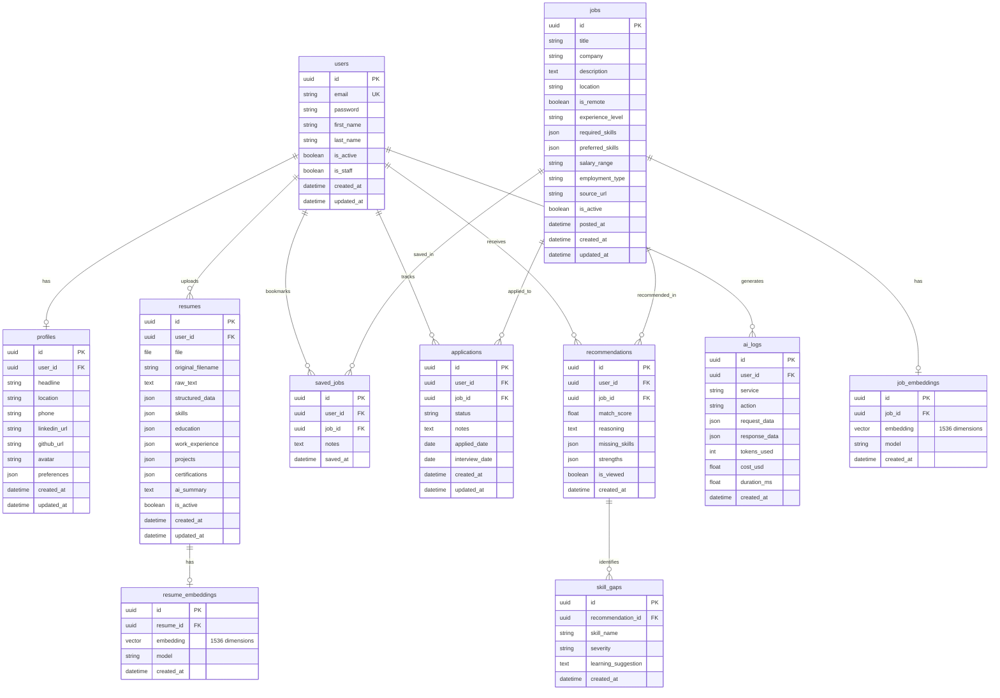

# FindItAI — Entity Relationship Diagram

## ER Diagram (Mermaid)



## Application Status Enum

```
applied → interview_scheduled → interview_completed → rejected
                                                   → offer_received → accepted
```

## Indexes (Planned)

| Table | Index | Purpose |
|-------|-------|---------|
| `resume_embeddings` | HNSW on `embedding` | Fast cosine similarity search |
| `job_embeddings` | HNSW on `embedding` | Fast cosine similarity search |
| `jobs` | GIN on `required_skills` | Skill-based filtering |
| `applications` | `(user_id, status)` | Dashboard queries |
| `recommendations` | `(user_id, match_score DESC)` | Top recommendations |

## pgvector Setup

```sql
CREATE EXTENSION IF NOT EXISTS vector;

-- Example index for cosine similarity
CREATE INDEX ON resume_embeddings
  USING hnsw (embedding vector_cosine_ops);

CREATE INDEX ON job_embeddings
  USING hnsw (embedding vector_cosine_ops);
```
